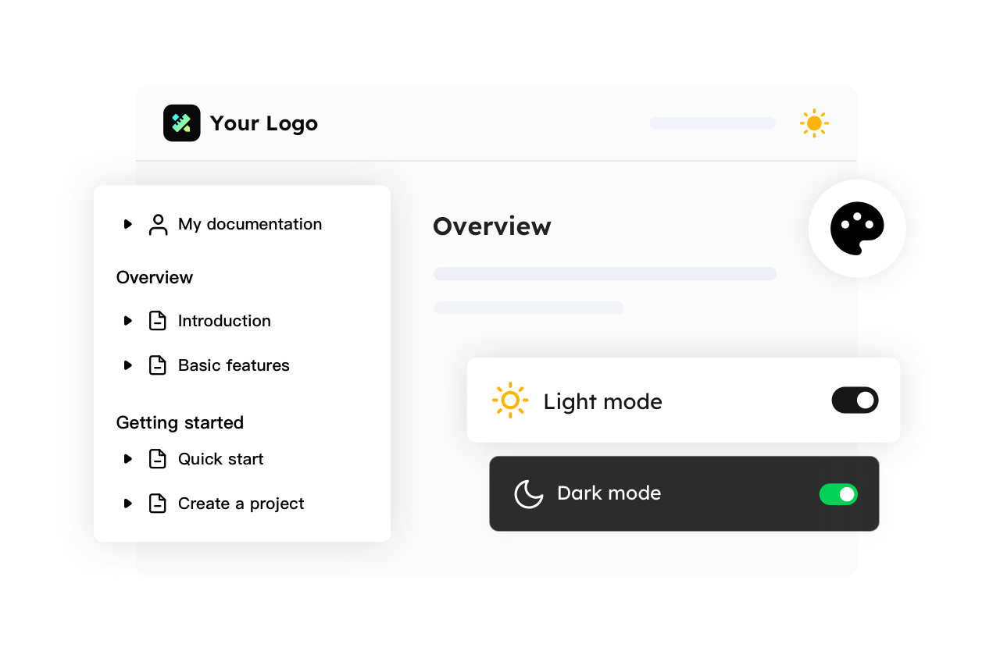

# Quickstart

> Step by Step buy $Mous on ICPSWAP.

## Step1 Download plug wallet

Download Plug wallet => create wallet or import => create pasword => done

Link Download plug wallet, please check [Plug Wallet](https://plugwallet.ooo/) .

<Frame width="auto" height="auto" >
  
</Frame>

## Step2 Customize your website

Elevate brand identity on your docs website by setting your logo & brand colors. You can also configure the site navigation, footer and docs sidebar to make your website more personalized.

For more information, please check [Customizing](https://docuo.spreading.io/customizing/customize-with-json-file) .

<Frame width="auto" height="auto" >
  
</Frame>

## Step3 Publish your website

Deploy your docs website with a single click, or update automatically after editing the content. From editor to https just in seconds, deploy once, deliver everywhere.

For more information, please check [Make an update](https://docuo.spreading.io/updating-website/make-an-update) .

<Frame width="auto" height="auto" >
  
</Frame>

## Step4 Engage your users

Data analysis enables you to deeply understand the information on page views, search analysis, session records and more, bridging the gap between your knowledge base and end-users.

For more information, please check [Search](https://docuo.spreading.io/engaging-users/search) & [Analytics](https://docuo.spreading.io/engaging-users/analytics) .

<Frame width="auto" height="auto" >
  
</Frame>

## All Done!
Congrats! You've set up your Docuo Docs and it's looking amazing! Need support or want to give some feedback? You can join our community or drop us an email at docuo@spreading.ai.
